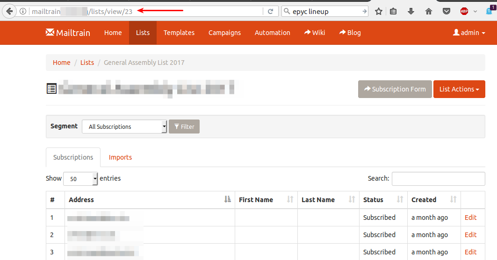

# Mailtrain-tools
An unofficial external tool to get information from mailtrain that I need.

At the moment this only does one thing, which is export a list to a CSV file, but I left it open to possibly making it do other stuff if I need anything else.

## Usage
* Clone this repository:
    * `git clone https://github.com/programster/mailtrain-tools.git`
* [Install composer](http://blog.programster.org/ubuntu-install-composer/) if you  haven't got it already.
* Navigate to the src directory and run `composer install` to install necessary packages
* Fill in the `settings.php.tmpl` file and remove the `.tmpl` extension.
* Execute the `main.php` script with the ID of the list you wish to export to a CSV. For example:

```
php main.php 27
```

* You now have a `list-x.csv` output file (where x is the ID of the list).

Please note that the ID of the list needs to be the number in the URL you see when viewing an individual list, which does *not* correlate to the numer beside the lists on the lists overview page (`/lists`)




## Roadmap
With a bit of work, the tool could be made to easily run through docker. For example:

```
docker run \
-e DB_HOST="mysql.my-host.com" \
-e DB_USER="mysql.my-host.com" \
-e DB_PASSWORD="mysql.my-host.com" \
-e DB_NAME="mysql.my-host.com" \
> output.csv
```
